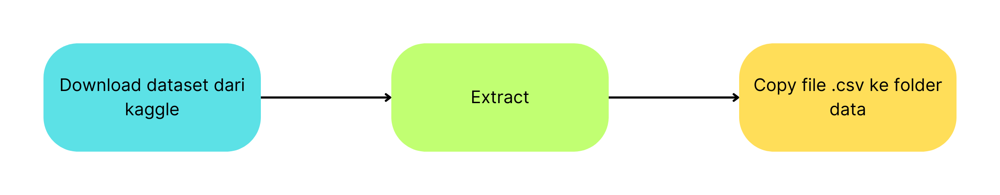
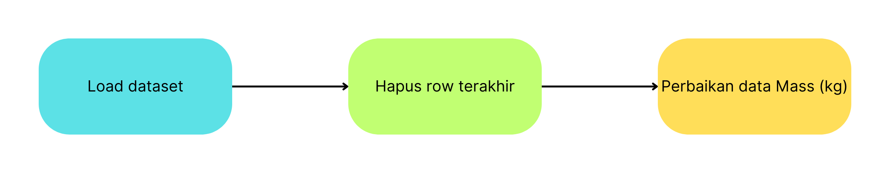
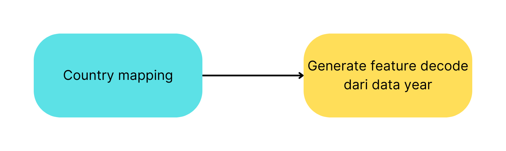
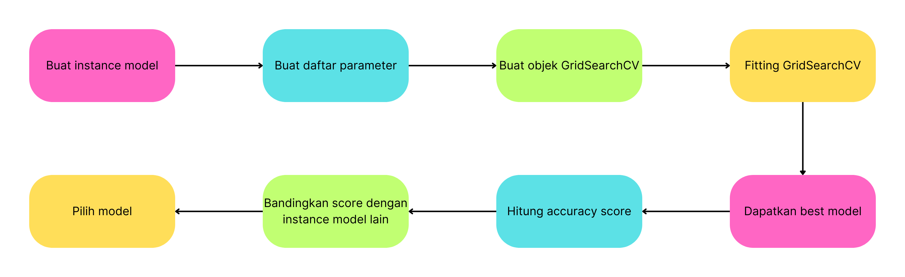

## Blok diagram persiapan data
Dataset untuk project ini ada di https://www.kaggle.com/datasets/rajkumarpandey02/list-of-artificial-objects-on-the-moon

<p align="center">
    
</p>

## Blok diagram preprocessing
Load dataset dari file `List of Artificial Objects on the Moon.csv`. Pada dataset ini, baris terakhir merupakan resume dari semua data di atasnya. Ada beberapa data pada kolom `Mass (kg)` yang merupakan berat perkiraan.
<p align="center">
    
</p>

## Blok diagram feature engineering
- Karena `Russia` adalah penerus terbesar dari `Uni Soviet` dalam hal program antariksa maka kita akan menggabungkan `Soviet Union` dan `Russia`. Untuk sisa negara yang hanya meluncurkan 1 object, akan digabung menjadi `Other`.
- Kita akan membuat kolom `Decade` yang merupakan  `Year` dibagi 10. Kemudian dikurang dengan decade pertama peluncuran object.
<p align="center">
    
</p>

## Blok diagram pemodelan dan evaluasi
<p align="center">
    
</p>

## Format message untuk melakukan predikasi via API
```
{api-service-url}/predict?country={country}&year={year}&mass={mass}
```

## Format message response dari API
**Jika survived**
```
1
```

**Jika crashed**
```
0
```

## Cara menjalankan service di Lokal

**Retraining model**
```
python train/modelling.py
```

**Running API**
```
uvicorn api.main:app
```

**Running Frontend**
```
streamlit run app/main.py
```
